# telc Deutsch B1 — Teil 2: Gespräch über ein Thema

In **Teil 2 der mündlichen Prüfung (ca. 5–6 Minuten)** führen die beiden Teilnehmenden ein Gespräch über ein alltagsrelevantes oder kontroverses Thema. Beide Teilnehmende haben in der Vorbereitungszeit einen kurzen Meinungsbeitrag aus einer Zeitschrift mit Bild erhalten (Partner A und B haben unterschiedliche Standpunkte zum selben Thema).

---

## 1. Die 5-Schritte-Erfolgsformel für Teil 2

Um die maximale Punktzahl in Teil 2 zu erreichen, gliedert man den eigenen Beitrag in fünf klare Schritte:

```
┌─────────────────────────────────────────────────────────────┐
│ 1. Einleitung & Textvorstellung                             │
│    "Ich habe einen Text zum Thema ... gelesen."             │
├─────────────────────────────────────────────────────────────┤
│ 2. Textwiedergabe (Person & Meinung)                        │
│    "Die Person heißt ... Sie ist ... Jahre alt und meint..." │
├─────────────────────────────────────────────────────────────┤
│ 3. Eigene Meinung & Begründung                              │
│    "Ich persönlich bin der Meinung, dass ... weil ..."      │
├─────────────────────────────────────────────────────────────┤
│ 4. Persönliche Erfahrung                                    │
│    "In meinem Alltag habe ich die Erfahrung gemacht, dass..."│
├─────────────────────────────────────────────────────────────┤
│ 5. Situation im Heimatland                                  │
│    "In meinem Heimatland ist das anders/ähnlich, denn ..."  │
└─────────────────────────────────────────────────────────────┘
                              │
                              ▼
        Anschließend: Fragen an den Partner stellen
```

---

## 2. Der große Redemittelkatalog für Teil 2

### A. Einleitung & Textwiedergabe
- *„Ich habe auf meinem Aufgabenblatt einen kurzen Beitrag zum Thema ‚...‘ gelesen.“*
- *„In dem Text geht es um eine Person namens [Name], die [Alter] Jahre alt ist und als [Beruf] arbeitet.“*
- *„Er/Sie vertritt den Standpunkt, dass ...“*
- *„Die Person berichtet, dass ...“*
- *„Für ihn/sie ist es besonders wichtig, dass ...“*

### B. Eigene Meinung äußern & begründen
- *„Meiner Meinung nach hat die Person völlig recht, wenn sie sagt, dass ...“*
- *„Ich sehe das etwas anders als [Name], weil ...“*
- *„Ich bin der festen Überzeugung, dass ...“*
- *„Einerseits stimme ich dem zu, andererseits muss man bedenken, dass ...“*
- *„Ein großer Vorteil davon ist ..., aber ein Nachteil könnte sein, dass ...“*

### C. Persönliche Erfahrungen schildern
- *„Aus eigener Erfahrung kann ich sagen, dass ...“*
- *„Als ich noch in meiner Heimat gewohnt habe, habe ich erlebt, dass ...“*
- *„Vor ein paar Jahren ist mir etwas Ähnliches passiert: ...“*
- *„In meinem täglichen Leben achte ich immer darauf, dass ...“*

### D. Situation im Heimatland beschreiben
- *„In meinem Heimatland [Land] ist die Situation ganz anders als in Deutschland.“*
- *„Bei uns ist es üblich, dass ...“*
- *„Im Vergleich zu Deutschland gibt es bei uns ...“*
- *„In [Land] spielt dieses Thema eine sehr große / eher untergeordnete Rolle, weil ...“*

### E. Fragen an die Partnerin / den Partner
- *„Welchen Text hattest du auf deinem Blatt?“*
- *„Was denkst du über die Meinung von [Name]?“*
- *„Hast du selbst schon Erfahrungen mit diesem Thema gesammelt?“*
- *„Wie ist denn die Situation bei dir im Heimatland?“*
- *„Würdest du in Zukunft auch so handeln?“*

---

## 3. Der offizielle Themenkatalog (27 Themen mit Partner A & B)

---

### Thema 1: Gesundheit (Ernährung, Sport & Vorsorge)

#### Partner A: Carsten Martens (23 Jahre, Angestellter)

> **Originaltext**:  
> *„Naja, in meinem Alter muss ich doch noch nicht auf die Gesundheit aufpassen. Ich fühle mich sehr wohl und esse und trinke einfach, was mir schmeckt. Und zum Sport bin ich nach der Arbeit einfach zu müde. Zum Glück bin ich schlank und muss nicht auf mein Gewicht achten.“*

- **Musterpräsentation Partner A**:
  > *„Ich habe einen Beitrag von Carsten Martens gelesen. Er ist 23 Jahre alt und arbeitet als Angestellter. Er meint, dass er in seinem jungen Alter noch nicht auf die Gesundheit oder Ernährung achten muss. Er isst und trinkt, worauf er Lust hat, und treibt keinen Sport, weil er nach der Arbeit zu müde ist.*  
  > *Ich persönlich bin anderer Meinung als Carsten. Auch wenn man jung und schlank ist, sollte man sich gesund ernähren und bewegen, denn schlechte Gewohnheiten schaden dem Körper langfristig.*  
  > *Ich selbst versuche, mindestens zweimal pro Woche Sport zu treiben und frisch zu kochen. In meiner Heimat treiben junge Menschen allerdings oft auch wenig Sport, weil im Alltag die Zeit fehlt.“*

#### Partner B: Silke Bauer (21 Jahre, Studentin)

> **Originaltext**:  
> *„Ich versuche schon, auf meine Gesundheit zu achten. Ich rauche nicht und mache regelmäßig Sport. Ich bin Mitglied in einem Turnverein und jogge auch sehr oft. Nur beim Essen kann ich mich manchmal nicht zurückhalten. Ich esse nämlich unheimlich gerne Süßigkeiten und Kuchen.“*

- **Musterpräsentation Partner B**:
  > *„Mein Text handelt von Silke Bauer, einer 21-jährigen Studentin. Sie achtet sehr auf ihre Gesundheit, raucht nicht und treibt regelmäßig Sport im Verein sowie beim Joggen. Ihre einzige Schwäche sind Süßigkeiten und Kuchen, auf die sie ungern verzichtet.*  
  > *Ich finde Silkes Einstellung sehr vernünftig und sympathisch. Man muss nicht perfekt leben; Bewegung und Nichtrauchen sind die wichtigsten Säulen der Gesundheit.*  
  > *In meinem Heimatland achten die Menschen heute viel mehr auf Fitness und gesunde Ernährung als früher.“*

- **Partnerfragen & Diskussion**:
  - *„Silke treibt viel Sport, aber isst gern Kuchen. Glaubst du, dass Sport ungesundes Essen ausgleichen kann?“*
  - *„Gehst du regelmäßig zu Vorsorgeuntersuchungen beim Arzt?“*

---

### Thema 2: Ausziehen und alleine wohnen

#### Partner A: Carsten Daubner (18 Jahre, Auszubildender)
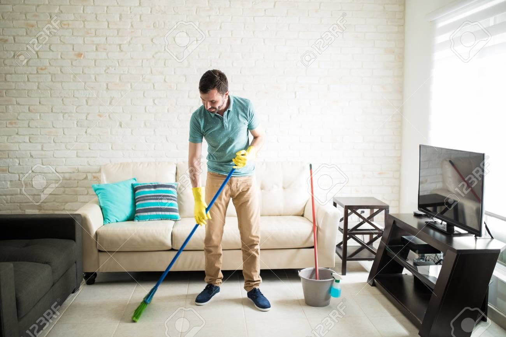
> **Originaltext**:  
> *„Pünktlich zu meinem Geburtstag bin ich ausgezogen. Meine Wohnung hat nur ein Zimmer, eine kleine Küche und ein Bad. Zum Glück ist sie nicht so teuer. Meine Eltern wollten eigentlich nicht, dass ich ausziehe und sie sagten ich solle erst meine Ausbildung beenden, aber ich habe sie überzeugt, dass ich meine Freiheit brauche. Ich möchte endlich auf eigenen Beinen stehen. Jetzt geben sie mir sogar ein bisschen Geld für die Miete.“*

#### Partner B: Jenny Groh (21 Jahre, Studentin)
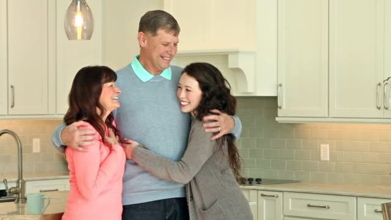
> **Originaltext**:  
> *„Ich wohne immer noch bei meinen Eltern. Warum sollte ich auch ausziehen? Es ist doch so viel bequemer zu Hause: Ich muss keine teure Miete zahlen, meine Mutter wäscht meine Wäsche und kocht für mich. Außerdem verstehe ich mich super mit meinen Eltern. Ich ziehe erst aus, wenn ich mein Studium beendet habe und festes Geld verdiene.“*

- **Musterdiskussion**:
  - *Partner A betont die frühe Selbstständigkeit und das Erlernen von Verantwortung.*
  - *Partner B argumentiert mit den hohen Mietkosten und dem Komfort während des Studiums.*
  - *Heimatland-Vergleich: In vielen südlichen und osteuropäischen Ländern sowie im Nahen Osten bleiben junge Menschen traditionell bis zur Heirat bei den Eltern.*

---

### Thema 3: Reisen (Individualreise vs. Berufliches Reisen)

#### Partner A: Klaus Schmidt (31 Jahre, Kundenberater)

> **Originaltext**:  
> *„In meinem Job muss ich viel reisen. Ich schätze, dass ich fast 100.000 km jedes Jahr unterwegs bin. Das meiste mit dem Firmenwagen, manchmal aber auch mit dem Flugzeug. Als ich diesen Job anfing, fand ich Reisen ganz toll, aber inzwischen ist es langweilig, immer nur von einem Hotelzimmer zum nächsten unterwegs zu sein.“*

#### Partner B: Stefanie Berger (24 Jahre, Studentin)

> **Originaltext**:  
> *„Reisen macht mir wahnsinnig Spaß. Immer wenn ich frei habe, fahre ich weg. Da ich einige Freunde im Ausland habe, komme ich sehr viel herum. Wir besuchen uns gegenseitig, d. h. ich kann bei ihnen wohnen und muss nur die Reise bezahlen. Und Zugfahrten sind für Studenten gar nicht so teuer.“*

---

### Thema 4: Familie (Kinder vs. Single-Leben)

#### Partner A: Nadja Beckmann (36 Jahre, Angestellte)
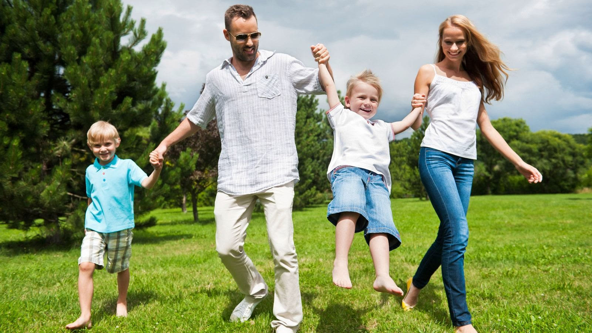
> **Originaltext**:  
> *„Für mich stand schon immer fest: Ich möchte Kinder haben. Eine Familie gibt einem Halt und Sicherheit im Leben. Jetzt haben mein Mann und ich zwei tolle Söhne. Natürlich ist es manchmal anstrengend, Beruf und Familie zu vereinbaren, aber das Lächeln meiner Kinder entschädigt mich für alles.“*

#### Partner B: Anton Meyer (34 Jahre, Manager)

> **Originaltext**:  
> *„Ich lebe allein und genieße diese Freiheit. Im Moment denke ich nicht über eine eigene Familie nach. Naja, ich habe die ideale Partnerin auch noch nicht gefunden. Ich brauche meine Unabhängigkeit für meine Karriere und meine Hobbys. Kinder bedeuten eine enorme Verantwortung, für die ich mich noch nicht bereit fühle.“*

---

### Thema 5: Wohnen in der Großstadt (Berlin vs. Landleben)

#### Partner A: Anna Schudt (32 Jahre, Musikerin)

> **Originaltext**:  
> *„Also, ich liebe es, in einer Großstadt zu leben! Deshalb bin ich nach Berlin gezogen. Viele Menschen, unterschiedliche Kulturen, rund um die Uhr Veranstaltungen: Hier ist was los, hier fühle ich mich wohl. Außerdem gibt es für mich nur in einer Großstadt wie Berlin Arbeit.“*

#### Partner B: Uwe Meister (36 Jahre, Beamter)

> **Originaltext**:  
> *„Ich wohne gern auf dem Land und verbringe viel Zeit im Garten und an der frischen Luft. Das Stadtleben ist mir ganz einfach zu laut und zu hektisch. Zum Ausgehen oder Einkaufen fahre ich schon mal in die nächste Stadt. Danach bin ich aber meistens froh, wenn ich wieder zu Hause sein kann.“*

---

### Thema 6: Großeltern (Familienbindung vs. Distanz)

#### Partner A: Katja Jantos (29 Jahre, Fotografin)
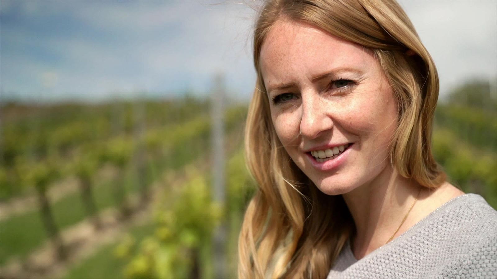
> **Originaltext**:  
> *„Ich habe meine Großeltern leider nie kennengelernt. Gern hätte ich mit ihnen über ihre Kindheit und unsere Familiengeschichte gesprochen. Ich hätte ihnen auch viele Fragen gestellt. Es ist traurig, wenn man diese Generation nicht miterleben darf.“*

#### Partner B: Michael Schmidt (32 Jahre, Manager)

> **Originaltext**:  
> *„Ich sehe meine Großeltern nur selten. Sie sind schon älter und erzählen immer die gleichen Geschichten von früheren Zeiten. Das finde ich langweilig. Aber so ist das eben. Manche Menschen in diesem Alter leben einfach in einer anderen Welt.“*

---

### Thema 7: Verkehrsmittel (Fahrrad vs. Auto)

#### Partner A: Carola Ahrenholz (25 Jahre, Sekretärin)
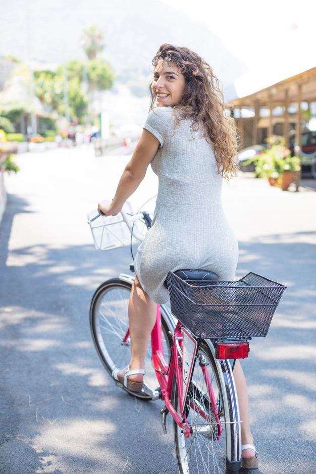
> **Originaltext**:  
> *„Im Sommer fahre ich immer mit dem Fahrrad zur Arbeit. Dann komme ich morgens schon munter ins Büro und abends kann ich mich beim Fahren wunderbar entspannen. Nur wenn es regnet, nehme ich den Bus. Im Winter fahre ich mit einer Kollegin im Auto mit und beteilige mich am Benzingeld.“*

#### Partner B: Bernd Kleinefeld (45 Jahre, Elektrotechniker)
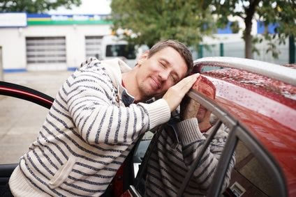
> **Originaltext**:  
> *„Mein Auto brauche ich am meisten für meine Freizeitaktivitäten: Am Wochenende machen wir Ausflüge, unter der Woche fahre ich in die Stadt, ins Kino oder zum Sport. Um zur Arbeit zu kommen, benutze ich auch das Auto. Und weil wir auf dem Land wohnen, muss ich ziemlich oft auch die Kinder irgendwohin bringen.“*

---

### Thema 8: Wohnen (Stadtwohnung vs. Haus mit Garten)

#### Partner A: Rainer Jobke (42 Jahre, Angestellter)
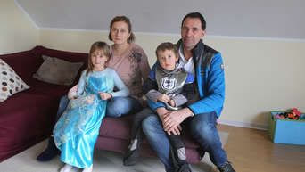
> **Originaltext**:  
> *„Wir wohnen in einer 3-Zimmer-Wohnung in der Stadt. Zwar haben die Kinder nicht genug Platz zum Spielen, aber zentral zu wohnen, hat auch Vorteile: Wir brauchen kein zweites Auto, die Schulen sind nah und ich kann zu Fuß zur Arbeit gehen.“*

#### Partner B: Volker Kühlheim (36 Jahre, Techniker)
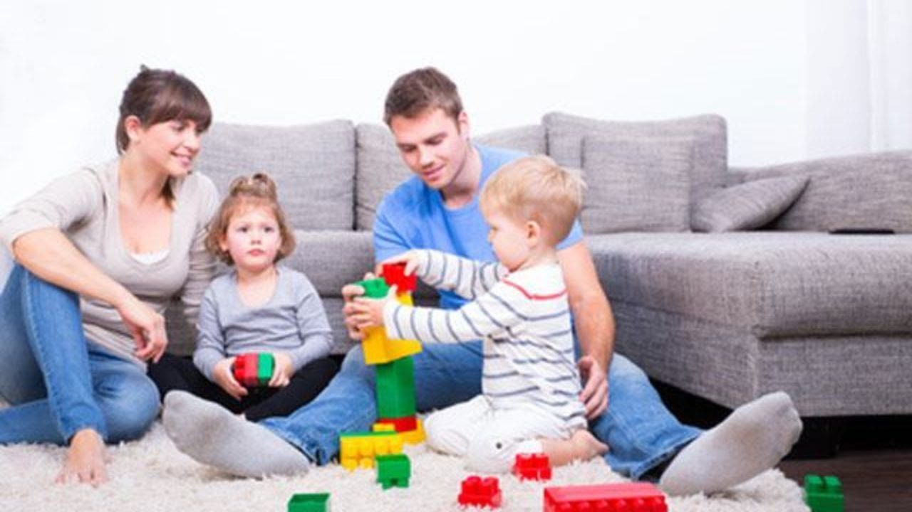
> **Originaltext**:  
> *„Im Moment sind wir auf Wohnungssuche. Ein kleines Haus mit Garten in einem Vorort wäre für uns ideal. Dann könnten wir für die Kinder endlich einen Hund kaufen und hätten am Wochenende Ruhe vom Lärm.“*

---

### Thema 9: Einkaufen (Budget & Sparen vs. Großeinkauf)

#### Partner A: Juliane Teubert (18 Jahre, Auszubildende)

> **Originaltext**:  
> *„Ich bin noch in der Ausbildung und verdiene nicht viel. Das Geld reicht meistens nicht mal bis Monatsende. Gott sei Dank wohne ich noch bei meinen Eltern und muss nur für meine persönlichen Ausgaben aufkommen: Kleidung, Kosmetik, Zeitschriften, mein Fahrgeld und ab und zu Schmuck.“*

#### Partner B: Paul Krügel (27 Jahre, Familienvater)

> **Originaltext**:  
> *„Ich fahre einmal in der Woche in einen Großmarkt einkaufen. Dann packe ich immer den ganzen Kofferraum voll mit den Sachen für die ganze Woche. Im Großmarkt sind die Preise besser. Was ich nicht vergessen darf, ist die Einkaufsliste von meiner Frau. Sonst kaufe ich lauter unnötige Sachen.“*

---

### Thema 10: Mensch und Tier (Haustiere)

#### Partner A: Darnai Müller (13 Jahre, Schüler)

> **Originaltext**:  
> *„Endlich habe ich den Hund bekommen, den ich mir schon so lange gewünscht habe. Seit Jahren bitte ich meine Eltern darum. Aber sie wollten die Verantwortung für ein Tier erst übernehmen, wenn ich alt genug bin, um mit ihm Gassi zu gehen.“*

#### Partner B: Vanessa Dannewald (24 Jahre, Studentin)

> **Originaltext**:  
> *„Ich habe zwar kein Haustier, aber trotzdem habe ich ein Herz für Tiere. Nur bin ich der Meinung, dass Tiere in ihre natürliche Umgebung gehören und nicht in eine kleine Stadtwohnung. Deshalb bin ich auch aktives Mitglied in einem Tierschutzverein.“*

---

### Thema 11: Der beste Freund / Die beste Freundin

#### Partner A: Sandra Polanski (46 Jahre, Köchin)
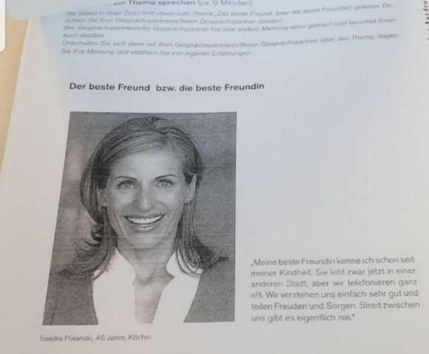
> **Originaltext**:  
> *„Meine beste Freundin kenne ich schon seit meiner Kindheit. Sie lebt zwar jetzt in einer anderen Stadt, aber wir telefonieren ganz oft. Wir verstehen uns einfach sehr gut und teilen Freuden und Sorgen. Streit zwischen uns gibt es eigentlich nie.“*

#### Partner B: Holger Münz (25 Jahre, Betriebswirt)
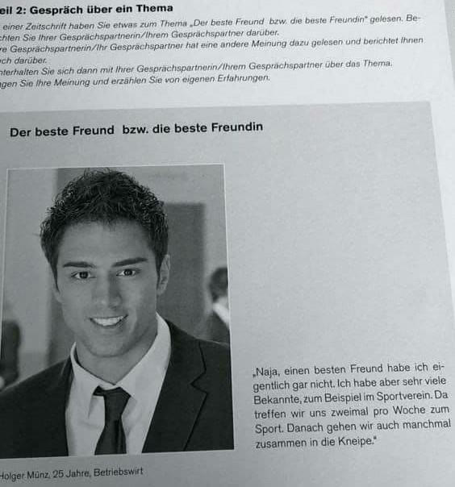
> **Originaltext**:  
> *„Naja, einen besten Freund habe ich eigentlich gar nicht. Ich habe aber sehr viele Bekannte, zum Beispiel im Sportverein. Da treffen wir uns zweimal pro Woche zum Sport. Danach gehen wir auch manchmal zusammen in die Kneipe.“*

---

### Thema 12: Geld (Sparen vs. Genießen)

#### Partner A: Marco Schmetz (24 Jahre, Bankangestellter)
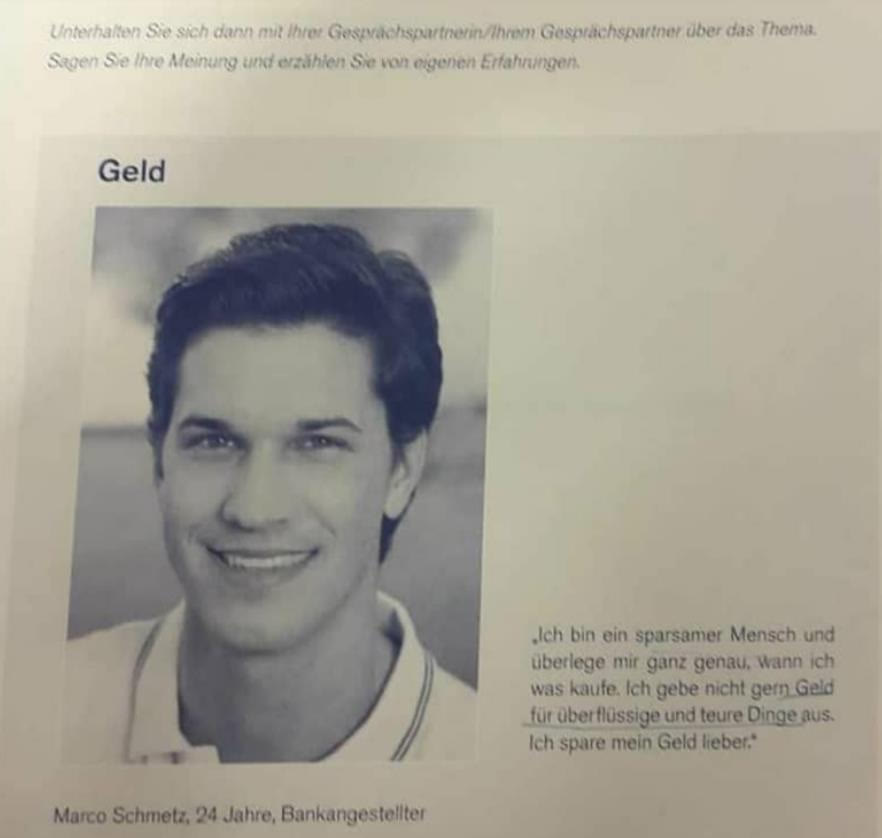
> **Originaltext**:  
> *„Ich bin ein sparsamer Mensch und überlege mir ganz genau, wann ich was kaufe. Ich gebe nicht gern Geld für überflüssige und teure Dinge aus. Ich spare mein Geld lieber für spätere Investitionen.“*

#### Partner B: Anne Spieler (30 Jahre, Apothekerin)
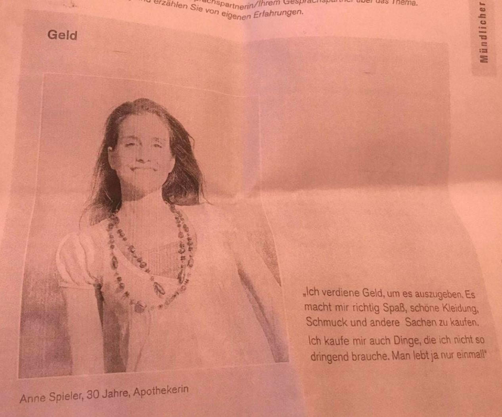
> **Originaltext**:  
> *„Ich verdiene Geld, um es auszugeben. Es macht mir richtig Spaß, schöne Kleidung, Schmuck und andere Sachen zu kaufen. Ich kaufe mir auch Dinge, die ich nicht so dringend brauche. Man lebt ja nur einmal!“*

---

### Thema 13: Hauskauf (Eigentum vs. Mieten)

#### Partner A: Silke Kühne (39 Jahre, Rechtsanwältin)
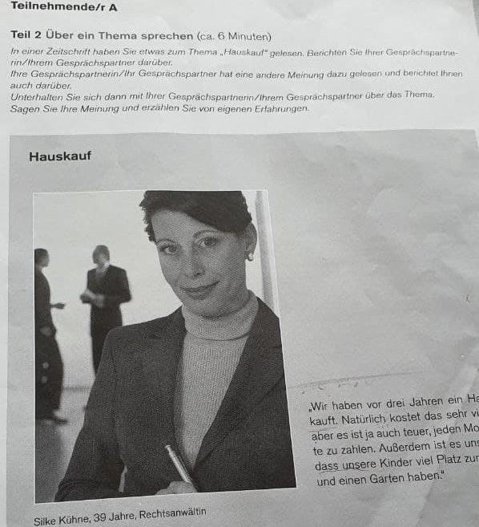
> **Originaltext**:  
> *„Wir haben vor drei Jahren ein Haus gekauft. Natürlich kostet das sehr viel Geld, aber es ist ja auch teuer, jeden Monat Miete zu zahlen. Außerdem ist es uns wichtig, dass unsere Kinder viel Platz zum Spielen und einen Garten haben.“*

#### Partner B: Jörg Göbel (30 Jahre, Elektroingenieur)

> **Originaltext**:  
> *„Ein Haus kaufen? – Nein, das kommt für mich nicht infrage. Denn ich weiß nicht, wo ich in den nächsten Jahren leben werde. Vielleicht muss ich aus beruflichen Gründen ins Ausland ziehen. Außerdem lebe ich allein und brauche nicht so viel Platz.“*

---

### Thema 14: Heiraten (Hochzeit feiern vs. Zusammenleben ohne Trauschein)

#### Partner A: Anna Herzog (36 Jahre, Sekretärin)
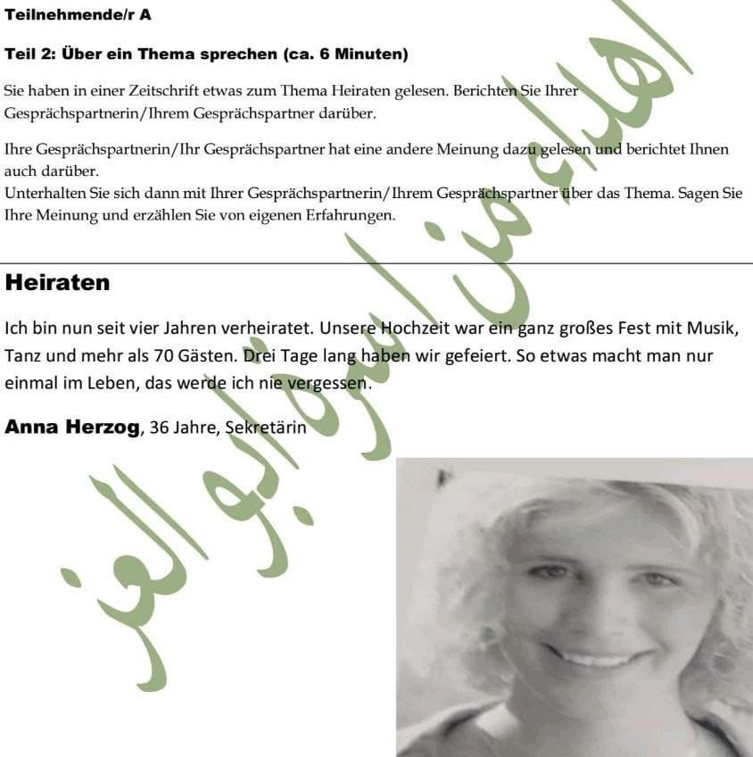
> **Originaltext**:  
> *„Ich bin nun seit vier Jahren verheiratet. Unsere Hochzeit war ein ganz großes Fest mit Musik, Tanz und mehr als 70 Gästen. Drei Tage lang haben wir gefeiert. So etwas macht man nur einmal im Leben, das werde ich nie vergessen.“*

#### Partner B: Frank Ehrmann (58 Jahre, Verkäufer)
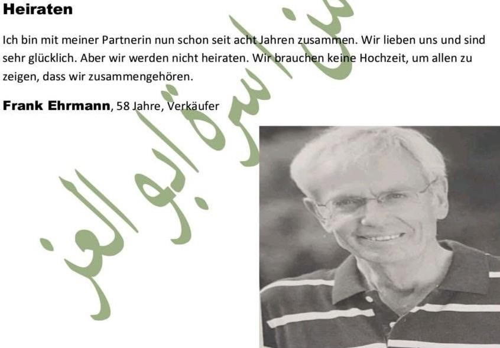
> **Originaltext**:  
> *„Ich bin mit meiner Partnerin nun schon seit acht Jahren zusammen. Wir lieben uns und sind sehr glücklich. Aber wir werden nicht heiraten. Wir brauchen keine Hochzeit, um allen zu zeigen, dass wir zusammengehören.“*

---

### Thema 15: Schöner Wohnen (Möbeldesign & Ästhetik)

#### Partner A: Mara Weiß (39 Jahre, Teamleiterin)
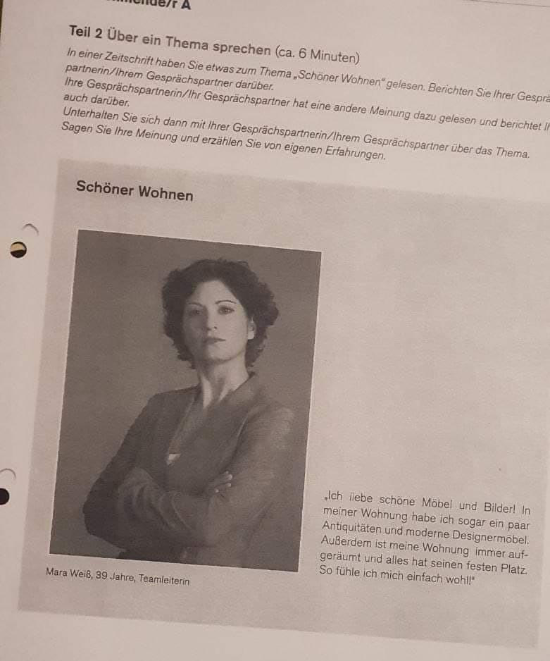
> **Originaltext**:  
> *„Ich liebe schöne Möbel und Bilder! In meiner Wohnung habe ich sogar ein paar Antiquitäten und moderne Designermöbel. Außerdem ist meine Wohnung immer aufgeräumt und alles hat seinen festen Platz. So fühle ich mich einfach wohl!“*

#### Partner B: Stefan Heeg (38 Jahre, Lehrer)
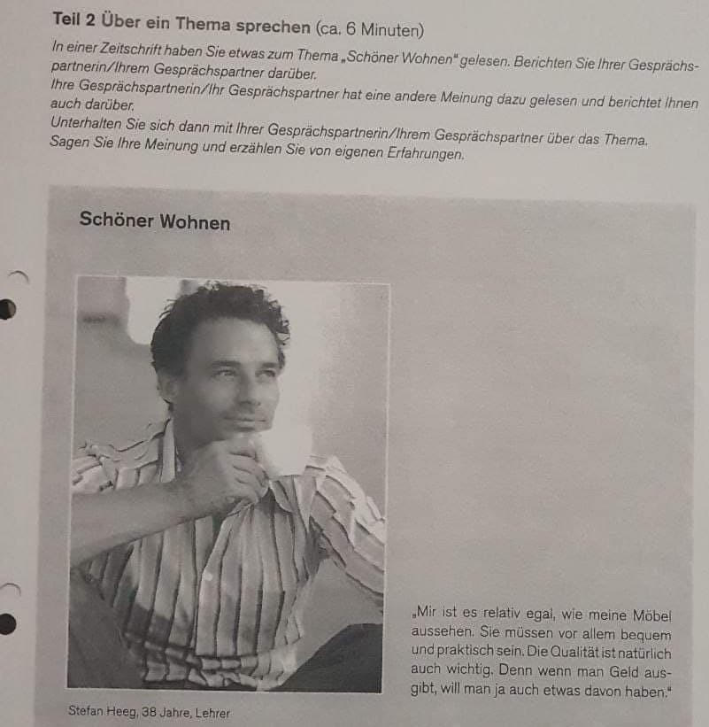
> **Originaltext**:  
> *„Mir ist es relativ egal, wie meine Möbel aussehen. Sie müssen vor allem bequem und praktisch sein. Die Qualität ist natürlich auch wichtig. Denn wenn man Geld ausgibt, will man ja auch etwas davon haben.“*

---

### Thema 16: Stress im Alltag und Beruf

#### Partner A: Claudia Gärtner (42 Jahre, Sekretärin)
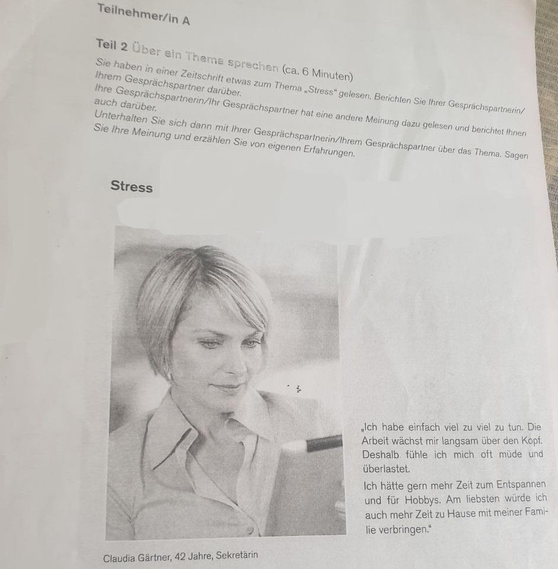
> **Originaltext**:  
> *„Ich habe einfach viel zu viel zu tun. Die Arbeit wächst mir langsam über den Kopf. Deshalb fühle ich mich oft müde und überlastet. Ich hätte gern mehr Zeit zum Entspannen und für Hobbys. Am liebsten würde ich auch mehr Zeit zu Hause mit meiner Familie verbringen.“*

#### Partner B: Andreas Elbert (35 Jahre, Verkaufsleiter)
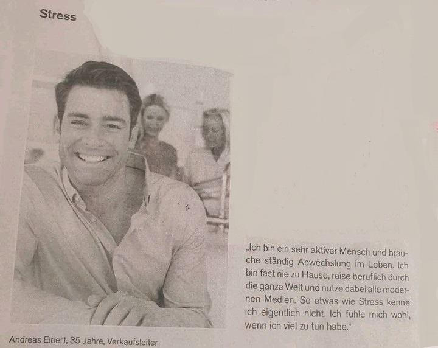
> **Originaltext**:  
> *„Ich bin ein sehr aktiver Mensch und brauche ständig Abwechslung im Leben. Ich bin fast nie zu Hause, reise beruflich durch die ganze Welt und nutze dabei alle modernen Medien. So etwas wie Stress kenne ich eigentlich nicht. Ich fühle mich wohl, wenn ich viel zu tun habe.“*

---

### Thema 17: Urlaub mit Freunden

#### Partner A: Tamara Rößner (31 Jahre, Lehrerin)

> **Originaltext**:  
> *„Mein Mann und ich fahren nie zusammen mit Bekannten in den Urlaub. Wir möchten diese Zeit lieber zu zweit verbringen. Außerdem wollen wir unsere Ruhe haben und uns erholen. Einfach nur das tun, wozu wir Lust haben. Das wäre in einer Gruppe zu schwierig.“*

#### Partner B: Teilnehmer B (29 Jahre, Ingenieur)

> **Originaltext**:  
> *„Mir wäre es zu langweilig, den Urlaub allein zu verbringen. Deshalb fahre ich immer mit einer Gruppe von Freunden in den Urlaub. Wir unternehmen dann sehr viel und machen gemeinsame Ausflüge. Und abends wird richtig gefeiert!“*

---

### Thema 18: Online Lebensmittel kaufen

#### Partner A: Tobias Krämer (27 Jahre, Student)
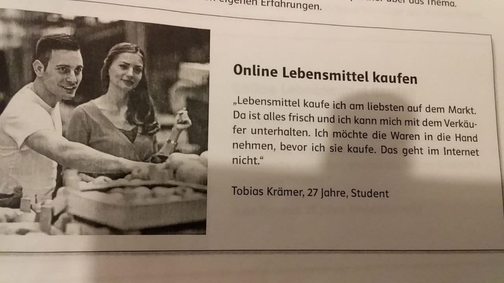
> **Originaltext**:  
> *„Lebensmittel kaufe ich am liebsten auf dem Markt. Da ist alles frisch und ich kann mich mit dem Verkäufer unterhalten. Ich möchte die Waren in die Hand nehmen, bevor ich sie kaufe. Das geht im Internet nicht.“*

#### Partner B: Irina Kovalcik (25 Jahre, Webdesignerin)
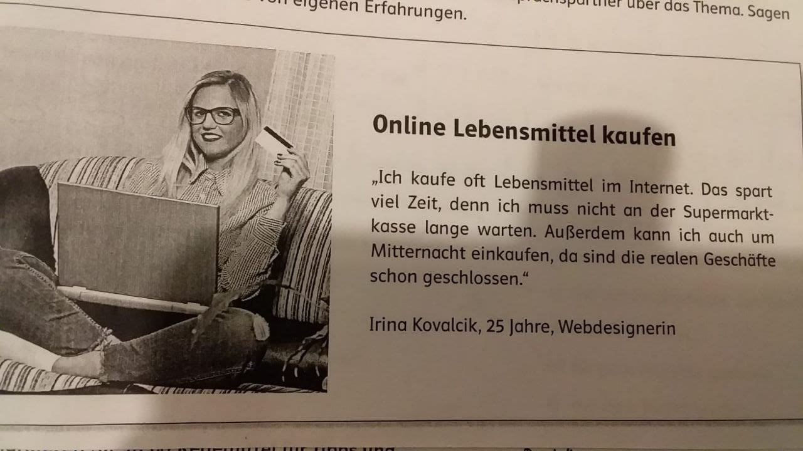
> **Originaltext**:  
> *„Ich kaufe oft Lebensmittel im Internet. Das spart viel Zeit, denn ich muss nicht an der Supermarktkasse lange warten. Außerdem kann ich auch um Mitternacht einkaufen, da sind die realen Geschäfte schon geschlossen.“*

---

### Thema 19: Haustiere (Variante B)

#### Partner A: Anna Herzog (28 Jahre, Sekretärin)
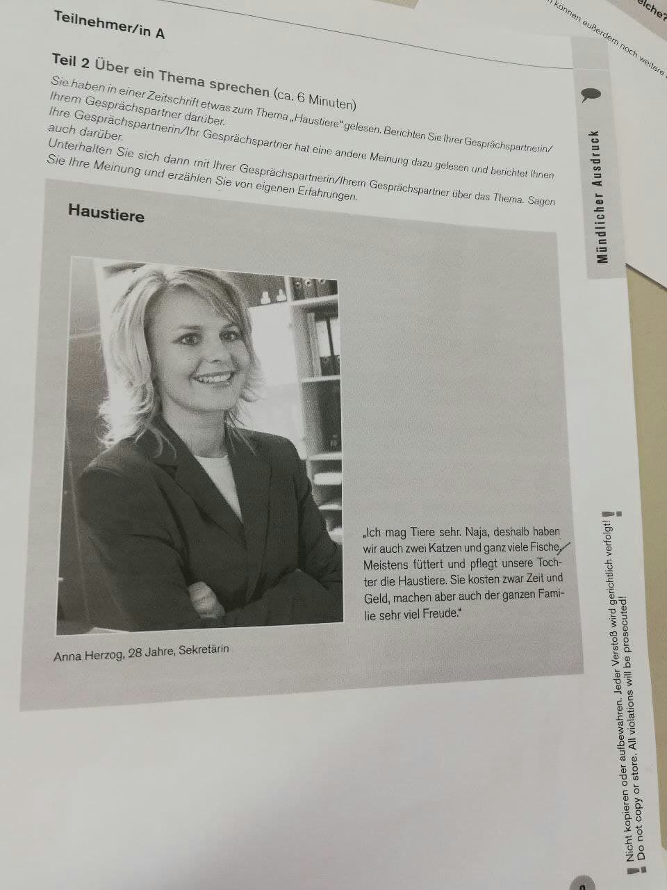
> **Originaltext**:  
> *„Ich mag Tiere sehr. Naja, deshalb haben wir auch zwei Katzen und ganz viele Fische. Meistens füttert und pflegt unsere Tochter die Haustiere. Sie kosten zwar Zeit und Geld, machen aber auch der ganzen Familie sehr viel Freude.“*

#### Partner B: Frank Ehrmann (38 Jahre, Verkäufer)
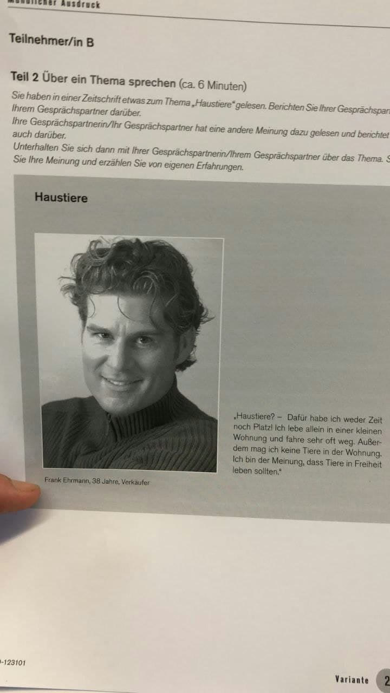
> **Originaltext**:  
> *„Haustiere? – Dafür habe ich weder Zeit noch Platz! Ich lebe allein in einer kleinen Wohnung und fahre sehr oft weg. Außerdem mag ich keine Tiere in der Wohnung. Ich bin der Meinung, dass Tiere in Freiheit leben sollten.“*

---

### Thema 20: Fernsehen und Medienkonsum

#### Partner A: Markus Jahn (34 Jahre, Krankenpfleger)
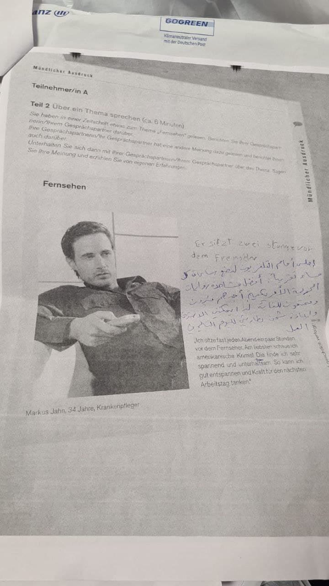
> **Originaltext**:  
> *„Ich sitze fast jeden Abend ein paar Stunden vor dem Fernseher. Am liebsten schaue ich amerikanische Krimis! Die finde ich sehr spannend und unterhaltsam. So kann ich gut entspannen und Kraft für den nächsten Arbeitstag tanken.“*

#### Partner B: Ramona Weber (30 Jahre, Journalistin)
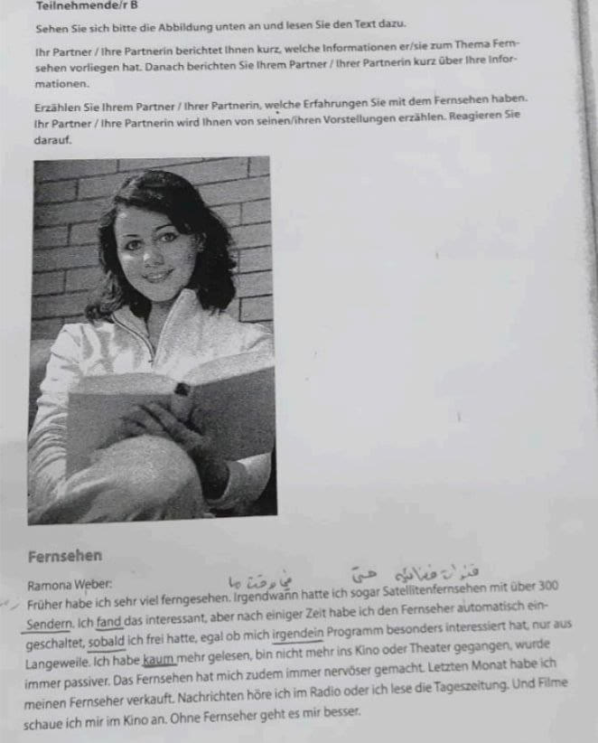
> **Originaltext**:  
> *„Früher habe ich sehr viel ferngesehen. Irgendwann hatte ich sogar Satellitenfernsehen mit über 300 Sendern. Nach einiger Zeit lief der Fernseher bei mir aber nur noch aus Gewohnheit und Langeweile. Ich wurde passiv und unruhig. Vor einem Monat habe ich meinen Fernseher verkauft. Ohne Fernseher geht es mir viel besser!“*

---

### Thema 21: Sammlungen und Sammeln

#### Partner A: Kai Bachmann (33 Jahre, Ökologe)
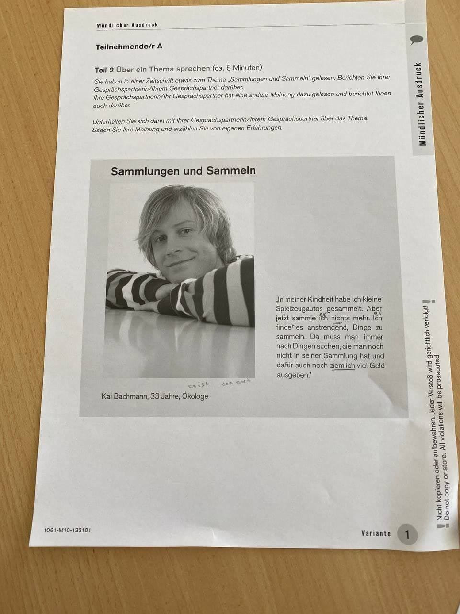
> **Originaltext**:  
> *„In meiner Kindheit habe ich kleine Spielzeugautos gesammelt. Aber jetzt sammle ich nichts mehr. Ich finde es anstrengend, Dinge zu sammeln. Da muss man immer nach Gegenständen suchen, die man noch nicht besitzt, und dafür auch noch viel Geld ausgeben.“*

#### Partner B: Gabriele (38 Jahre, Architektin)

> **Originaltext**:  
> *„Ich sammle seit einigen Jahren Armbanduhren. In der Zwischenzeit habe ich eine beachtliche Sammlung. Oft suche ich stundenlang nach seltenen Modellen im Internet. Dabei ist es mir egal, ob die Uhren neu oder gebraucht sind – Hauptsache, sie haben Stil.“*

---

### Thema 22: Zukunftspläne (Ausbildung, Studium & Familie)

#### Partner A: Jana (16 Jahre, Schülerin)
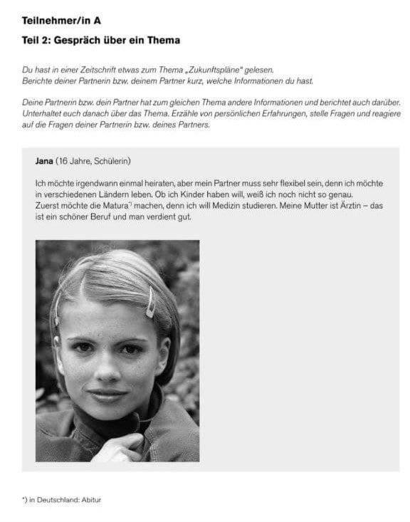
> **Originaltext**:  
> *„Ich möchte irgendwann einmal heiraten, aber mein Partner muss flexibel sein, denn ich möchte in verschiedenen Ländern leben. Zuerst mache ich das Abitur, denn ich will Medizin studieren. Meine Mutter ist Ärztin – das ist ein sinnvoller Beruf und man verdient gut.“*

#### Partner B: Max (17 Jahre, Schüler)
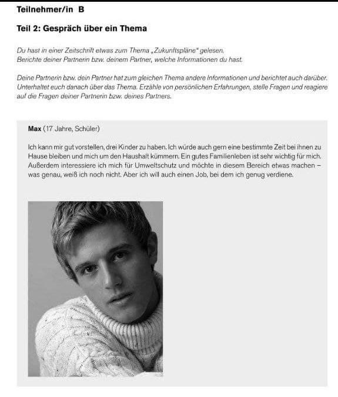
> **Originaltext**:  
> *„Ich kann mir gut vorstellen, drei Kinder zu haben. Ich würde auch gern für eine bestimmte Zeit bei ihnen zu Hause bleiben und mich um den Haushalt kümmern. Ein gutes Familienleben ist mir sehr wichtig. Außerdem möchte ich mich beruflich für den Umweltschutz engagieren.“*

---

### Thema 23: Gastfreundschaft

#### Partner A: Karina Fohrbeck (34 Jahre, Lehrerin)
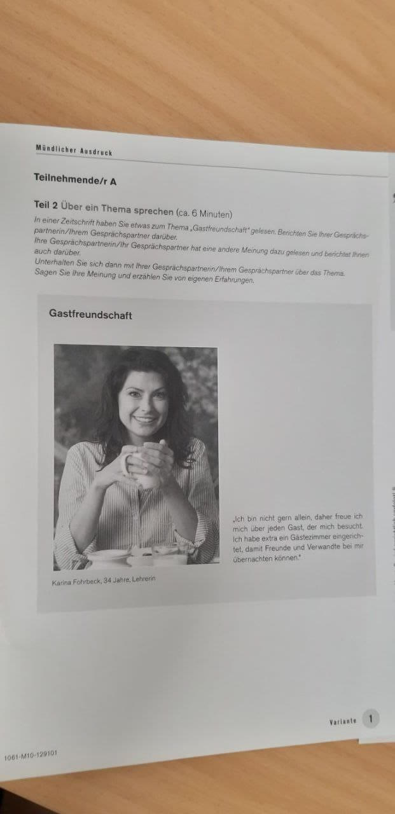
> **Originaltext**:  
> *„Ich bin nicht gern allein, daher freue ich mich über jeden Gast, der mich besucht. Ich habe extra ein Gästezimmer eingerichtet, damit Freunde und Verwandte auch spontan bei mir übernachten können.“*

#### Partner B: Niklas Weber (30 Jahre, Informatiker)
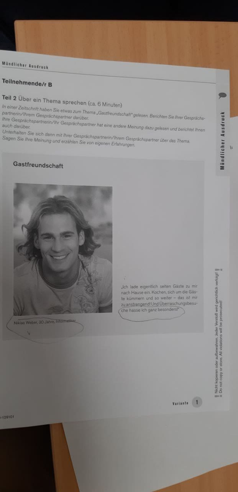
> **Originaltext**:  
> *„Ich lade eigentlich selten Gäste zu mir nach Hause ein. Kochen, sauber machen und sich den ganzen Abend um Besuch kümmern – das ist mir zu anstrengend! Und unangekündigte Überraschungsbesuche mag ich überhaupt nicht.“*

---

### Thema 24: Nachbarschaft und Nachbarn

#### Partner A: Torsten Gebhardt (21 Jahre, Büroangestellter)
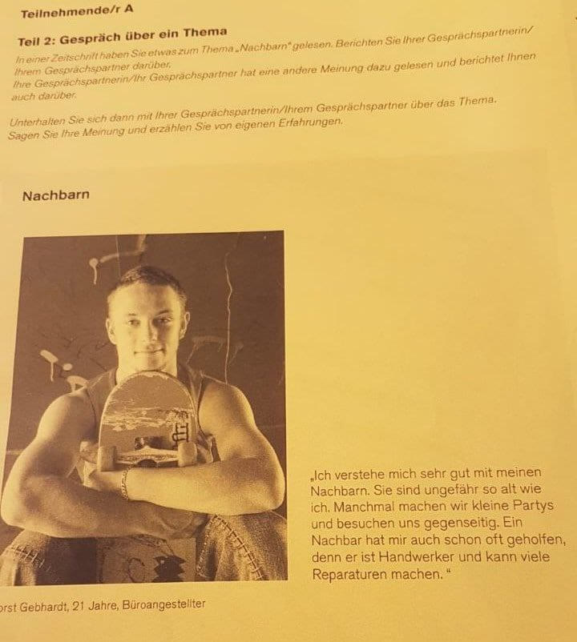
> **Originaltext**:  
> *„Ich verstehe mich sehr gut mit meinen Nachbarn. Sie sind ungefähr so alt wie ich. Manchmal machen wir kleine Partys und besuchen uns gegenseitig. Ein Nachbar hat mir auch schon oft bei Reparaturen geholfen, weil er Handwerker ist.“*

#### Partner B: Sabine Streif (24 Jahre, Büroangestellte)
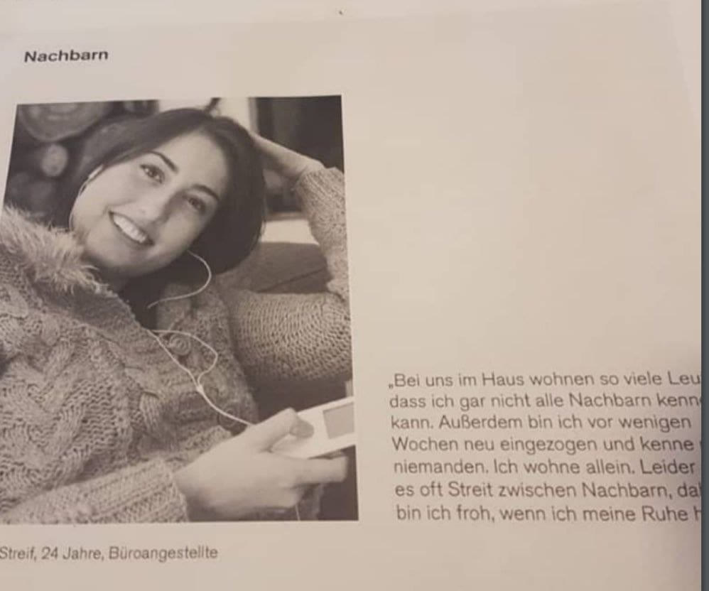
> **Originaltext**:  
> *„Bei uns im Haus wohnen so viele Parteien, dass ich gar nicht alle kenne. Ich wohne allein und arbeite viel. Da es zwischen einigen Nachbarn oft Streit um Lärm und Kehrwoche gibt, bin ich froh, wenn ich in meiner Wohnung einfach meine Ruhe habe.“*

---

### Thema 25: Arbeitszeiten in der Gastronomie

#### Partner A: Alexander (29 Jahre, Restaurantfachmann)
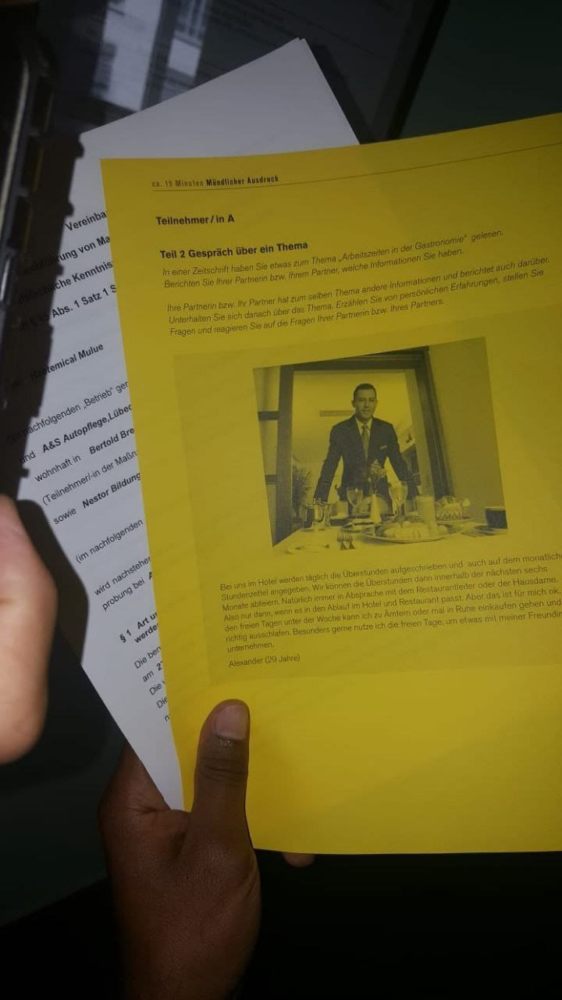
> **Originaltext**:  
> *„Bei uns im Hotel werden Überstunden exakt erfasst und wir können sie innerhalb von sechs Monaten als Freizeit abfeiern. An den freien Tagen unter der Woche kann ich Behördengänge erledigen, in Ruhe einkaufen oder ausschlafen. Das gefällt mir gut.“*

#### Partner B: Angelika (46 Jahre, Mutter einer Auszubildenden)
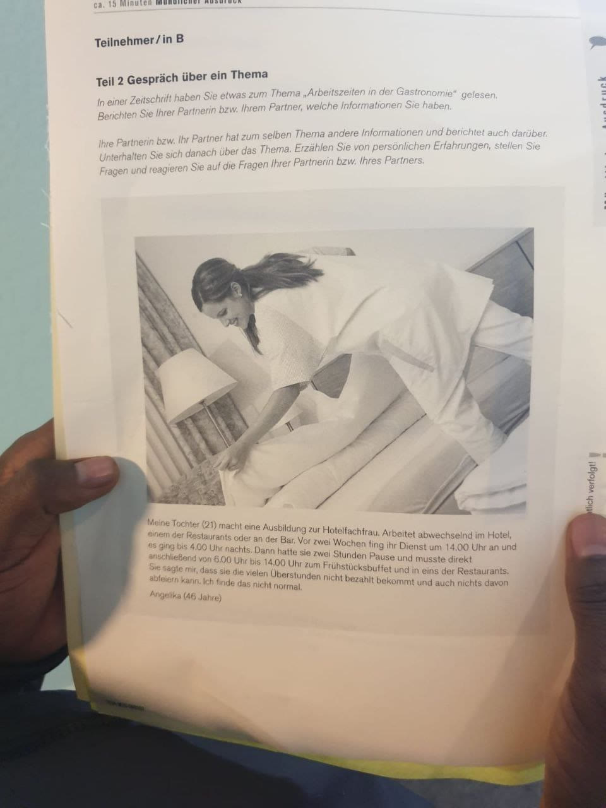
> **Originaltext**:  
> *„Meine Tochter macht eine Ausbildung zur Hotelfachfrau. Die Schichten sind oft unmenschlich: Dienst bis 4 Uhr morgens und um 6 Uhr schon wieder Frühstücksbuffet! Die vielen Überstunden werden weder bezahlt noch abgefeiert. Das finde ich absolut inakzeptabel.“*

---

### Thema 26: Telefonieren (mit Handy) in der Öffentlichkeit

#### Partner A: Nadine Wagner (32 Jahre, Immobilienmaklerin)
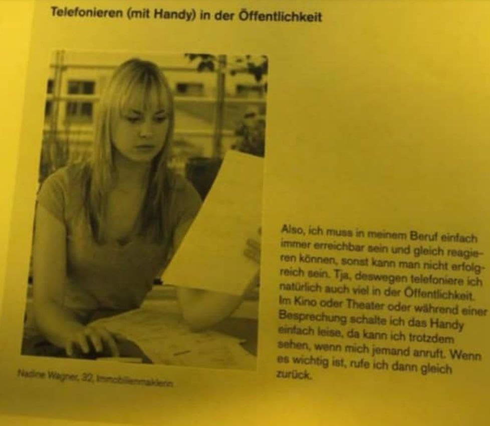
> **Originaltext**:  
> *„In meinem Beruf muss ich einfach ständig erreichbar sein, sonst verliert man Kunden. Deswegen telefoniere ich natürlich auch unterwegs in der Öffentlichkeit. Bei wichtigen Terminen schalte ich das Gerät lautlos, damit ich diskret reagieren kann.“*

#### Partner B: Peter Hoffmann (33 Jahre, Sozialarbeiter)
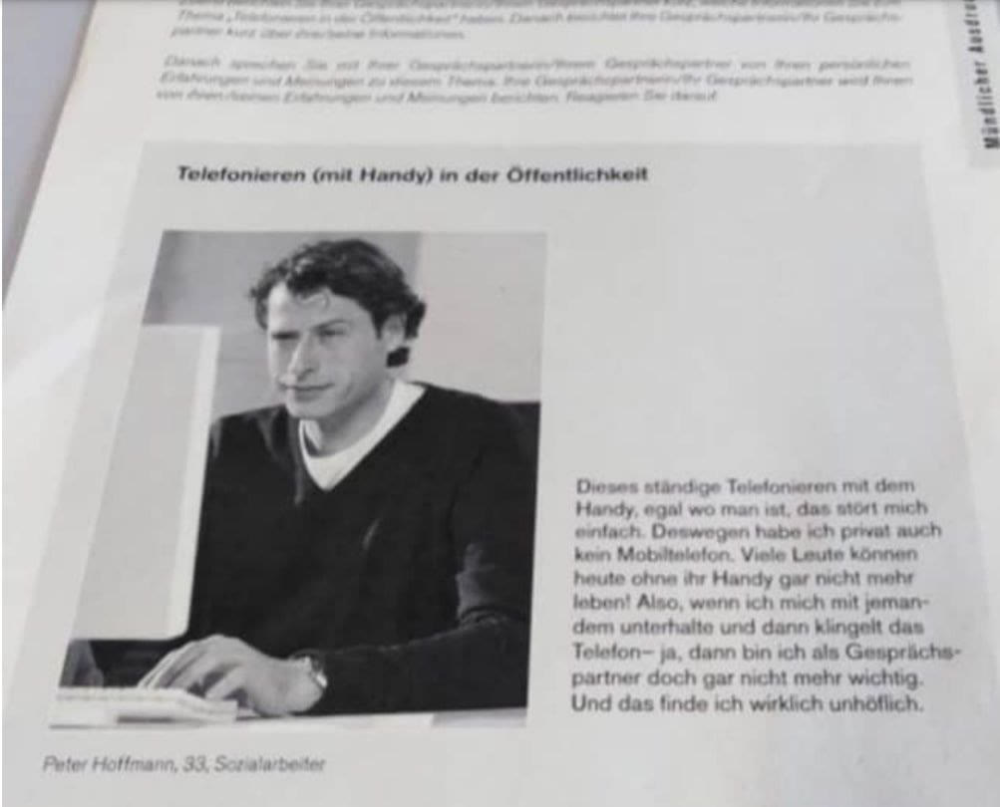
> **Originaltext**:  
> *„Dieses ständige laute Telefonieren in Bus und Bahn stört mich gewaltig. Privat besitze ich bewusst kein Smartphone. Wenn man sich mit jemandem unterhält und das Telefon klingelt, ist das Gespräch sofort zerstört. Das empfinde ich als sehr unhöflich.“*

---

### Thema 27: Geburtstage & Familienfeste

#### Partner A: Tobias Heinze (26 Jahre, Büroangestellter)
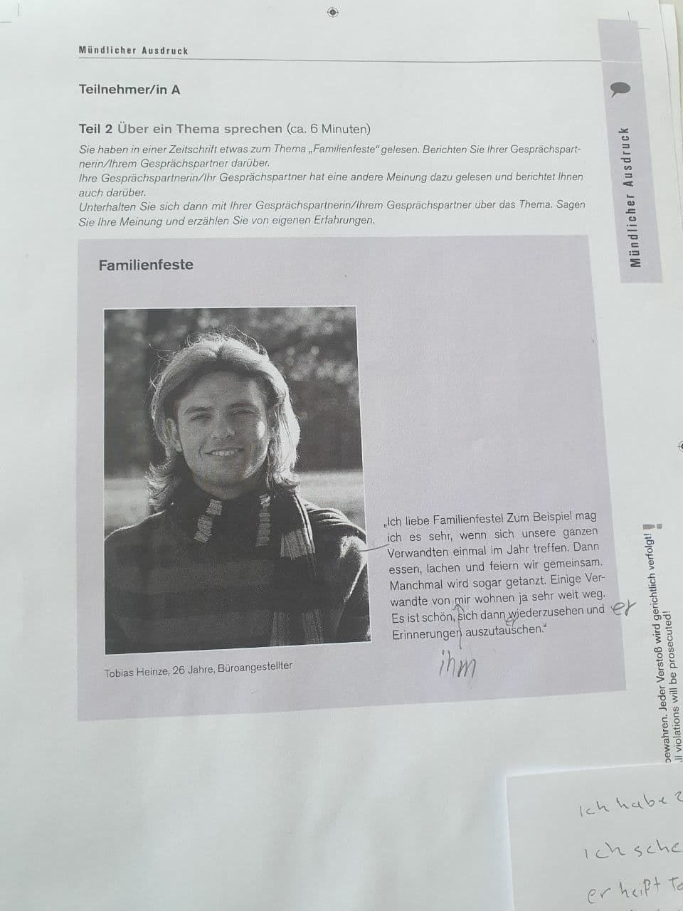
> **Originaltext**:  
> *„Ich liebe große Familienfeste! Mindestens einmal im Jahr kommen alle Verwandten zusammen, wir kochen gemeinsam, tanzen und tauschen alte Erinnerungen aus. Da viele Verwandte weit weg wohnen, sind solche Feste unverzichtbar.“*

#### Partner B: Niklas Lambert (23 Jahre, Student)
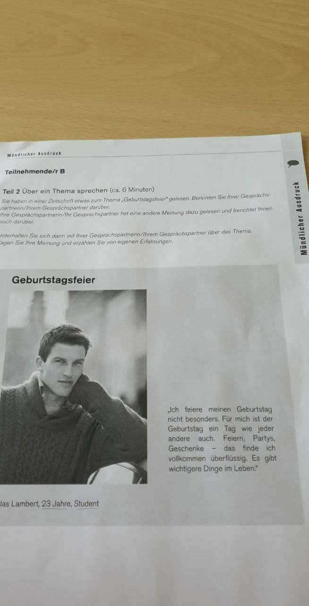
> **Originaltext**:  
> *„Ich feiere meinen Geburtstag gar nicht besonders. Für mich ist das ein Tag wie jeder andere. Teure Geschenke, förmliche Feiern und Smalltalk finde ich überflüssig. Gute Zeit kann man auch ohne festen Anlass mit Freunden verbringen.“*
